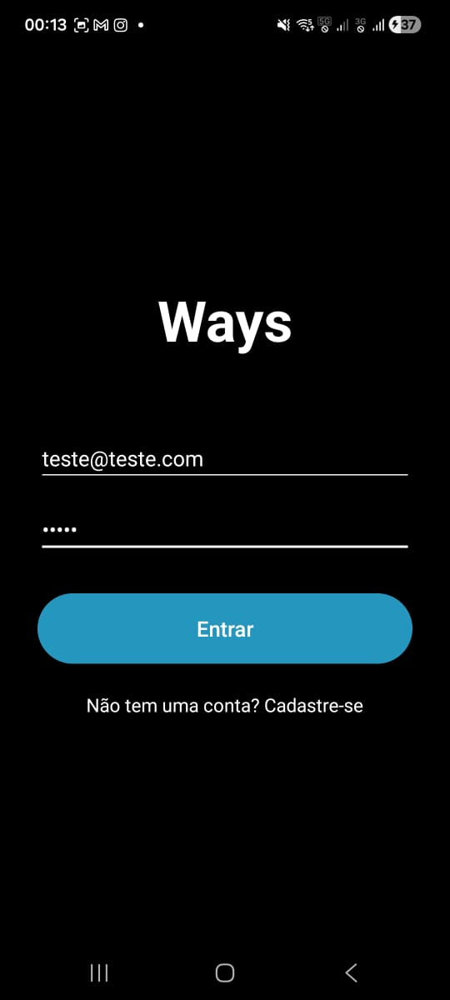
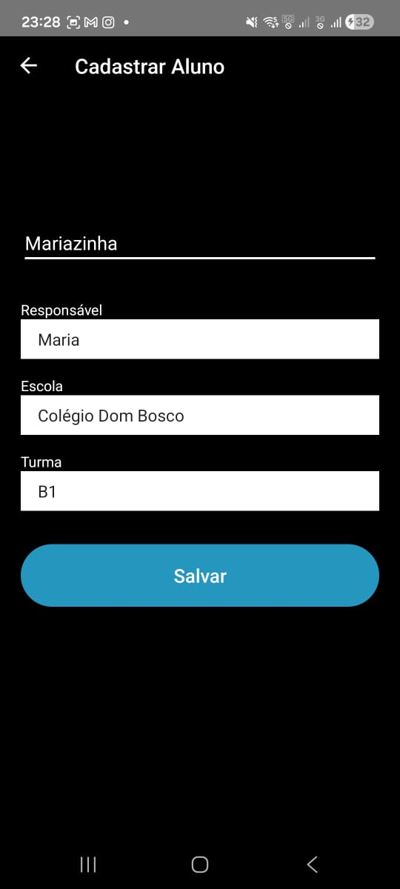
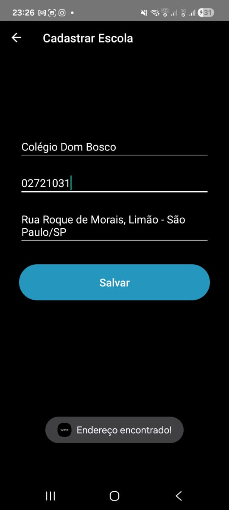
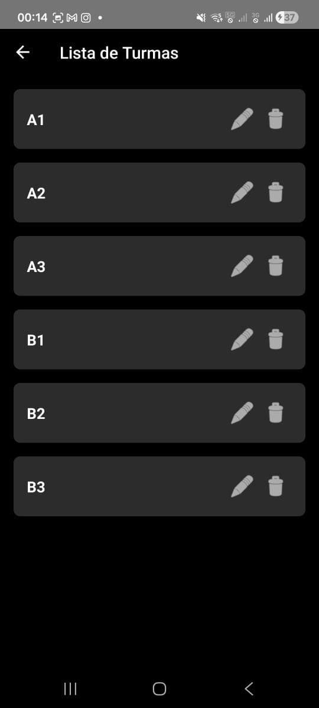
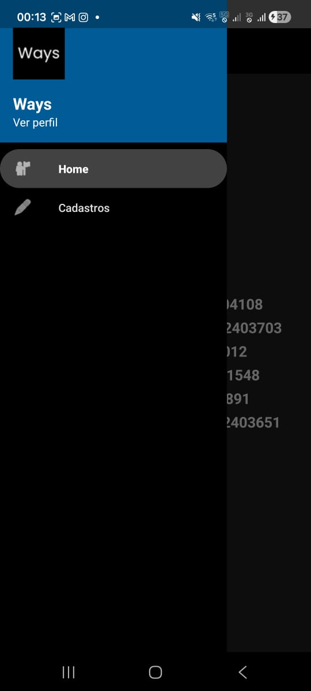

# Ways - Gestão de Transporte Escolar

## 📱 Descrição do App

O **Ways** é um aplicativo Android desenvolvido nativamente com Kotlin, focado na gestão de transporte escolar. O objetivo é facilitar a vida de condutores de vans escolares, permitindo o gerenciamento centralizado de alunos, responsáveis, escolas, turmas e condutores.

O aplicativo conta com um design moderno em **Dark Mode** inspirado no design do Uber, integração com API de CEPs e armazenamento local de dados.

---

## 📸 Telas Principais

| Login | Cadastro do Aluno | Integração ViaCEP |
|:-----------------:|:------------------:|:-----------------:|
|  |  |  |

| Lista de Turmas | Menu Principal | Dark Mode - UI |
|:---------------:|:--------------:|:------------:|
|  |  |  |

---

## 🛠 Tecnologias Utilizadas

*   **Linguagem:** [Kotlin](https://kotlinlang.org/)
*   **IDE:** [Android Studio](https://developer.android.com/studio)
*   **Banco de Dados Local:** SQLite (com `SQLiteOpenHelper`)
*   **Comunicação de Rede (API):** [Retrofit 2](https://square.github.io/retrofit/) & [GSON](https://github.com/google/gson)
*   **Navegação:** Android Navigation Component
*   **Layout:** XML (ConstraintLayout, LinearLayout, CardView) com ViewBinding
*   **Design:** Material Design (Custom Dark Theme - Inspirado no design do Uber)

---

## 🚀 Passo a Passo para Instalar e Rodar

Siga este guia para configurar o ambiente de desenvolvimento do zero.

### 1. Instalação do GIT
Acesse: https://git-scm.com/downloads

Você verá três botões principais:

- **Windows**
- **macOS**
- **Linux/Unix**

Clique no sistema correspondente ao seu computador.

### ➤ 1.2 Escolher a versão correta para seu sistema

### 🔹 **Windows**
Ao clicar, o site vai sugerir automaticamente a versão recomendada.

Você verá opções como:
- **32-bit Git for Windows Setup**
- **64-bit Git for Windows Setup**
- **ARM64 Git for Windows Setup** (para processadores ARM, como Surface Pro X)

Se você não sabe qual escolher:
- Computadores comuns → **64-bit**
- Surface ARM ou Windows ARM → **ARM64**

Baixe o arquivo `.exe`.

### 🔹 **macOS**
Você verá opções:
- **Intel (x86_64)** → Macs antigos (Macbook até 2020)
- **Apple Silicon (ARM64)** → M1, M2, M3

Se estiver com dúvida:
- Abra o Terminal e digite:
  ```bash
  uname -m

### 🔹 **Linux**

Instale o Git usando o gerenciador de pacotes da sua distribuição:
**Debian/Ubuntu**
```bash
sudo apt update
sudo apt install git
```

**Fedora**
```bash
sudo dnf install git
```

### ➤ 1.3 Instalando GIT

1. Execute o instalador (ou finalize a instalação pelo gerenciador de pacotes no Linux).
2. Clique em **Next**, **Next**, **Next**...
3. Mantenha todas as opções padrão.
4. Clique em **Finish** para concluir.


### 2. Clonar o Projeto

Escolha ou crie uma pasta no seu computador.
Abra o terminal dentro dela:

- **Windows:** clique com botão direito → *Git Bash Here*
- **macOS/Linux:** abra o Terminal normalmente

Execute:
```bash
git clone <URL do projeto obtida no botão "Code" do GitHub">
cd Ways
```


### 3. Instalação do Android Studio

### ➤ 3.1 Baixar
Acesse:
https://developer.android.com/studio

Escolha a versão de acordo com o seu sistema operacional:

- **Windows**
- **macOS (Intel ou Apple Silicon ARM)**
- **Linux**

### ➤ 3.2 Instalar

1. Execute o instalador.
2. Clique em **Next**, **Next**, **Next** para manter as configurações padrão.
3. Quando a instalação terminar, abra o Android Studio.
4. Na primeira abertura, aceite os termos e deixe o instalador baixar componentes adicionais (SDK, Platform Tools, etc).

### ➤ 3.3 Abrir o Projeto Ways

1. Na tela inicial do Android Studio, clique em **Open**.
2. Navegue até a pasta onde você clonou o projeto `Ways`.
3. Selecione a pasta e clique em **OK**.
4. Aguarde a sincronização do **Gradle** (pode demorar na primeira vez).
5. Quando o carregamento terminar, verifique se não há erros na barra inferior.


### 4. Configurando o Celular (Depuração USB)
Se o seu computador for lento para rodar o Emulador, rodar direto no celular é a melhor opção.
**O celular tem que ter Android**, em Iphones não irá funcionar.
1. No celular, vá em **Configurações > Sobre o telefone**.
2. Toque 7 vezes em **"Número da versão"** (ou "Número da compilação") até aparecer "Você agora é um desenvolvedor".
3. Volte, vá em **Sistema > Opções do Desenvolvedor**.
4. Ative a chave **"Depuração USB"**.

### 5. Instalando Drivers USB (Windows)
1. Conecte o celular ao PC via cabo USB.
2. Se o Android Studio não reconhecer o celular:
   * Baixe o [Driver USB Universal](https://developer.android.com/studio/run/win-usb) ou o driver específico da marca do seu celular (Samsung, Motorola, Xiaomi).
   * Instale o driver.
3. No celular, vai aparecer uma janela "Permitir depuração USB?". Clique em **"Permitir"**.

### 6. Rodando o App
1. No Android Studio, no topo direito, verifique se o seu celular aparece na lista de dispositivos.
2. Clique no botão verde ▶️ (**Run 'app'**).
3. O app será instalado e abrirá no seu celular.

---

## 🌐 Endpoints da API

O projeto utiliza a API pública do **ViaCEP** para preenchimento automático de endereços no cadastro de escolas.

*   **Base URL:** `https://viacep.com.br/ws/`
*   **Método:** `GET`
*   **Rota:** `/{cep}/json/`

**Exemplo de uso:**
Ao digitar 8 números no campo de CEP, o app dispara a requisição e preenche o Logradouro, Bairro, Cidade e UF automaticamente.

---

## 💾 Como funciona o CRUD (Banco de Dados)

O aplicativo utiliza o padrão **DAO (Data Access Object)** com **SQLite** nativo para persistência de dados. A lógica funciona da seguinte forma:

1.  **Model:** Classes de dados (ex: `Aluno`, `Escola`) representam as tabelas.
2.  **DatabaseHelper:** Classe responsável por criar (`onCreate`) e atualizar (`onUpgrade`) a estrutura das tabelas no banco de dados do celular (`tiodaperua.db`).
3.  **DAO:** Cada entidade tem sua classe DAO (ex: `UsuarioDAO`, `EscolaDAO`).
    *   **Create (C):** O método `.cadastrar()` recebe um objeto e usa `db.insert()` para salvar.
    *   **Read (R):** O método `.listar()` usa `db.rawQuery()` ou `db.query()` para retornar uma lista de objetos.
    *   **Update (U):** O método `.atualizar()` usa `db.update()` baseado no ID.
    *   **Delete (D):** O método `.excluir()` usa `db.delete()` baseado no ID.
4.  **UI:** Os Fragments chamam os métodos do DAO para exibir ou salvar as informações na tela.

---

## ✅ Funções Implementadas e Pendentes

### ✔️ Implementadas
- [x] Tela de Login e Cadastro de Usuário.
- [x] Dashboard com navegação intuitiva.
- [x] CRUD Completo de Alunos.
- [x] CRUD Completo de Responsáveis.
- [x] CRUD Completo de Turmas.
- [x] CRUD Completo de Escolas.
- [x] CRUD Completo de Condutores.
- [x] Integração com ViaCEP (Auto-preenchimento).
- [x] Design System Dark Mode Personalizado.

### 🚧 Pendentes (Próximos Passos)
- [ ] Integração com banco de dados na nuvem (Firebase).
- [ ] Otimização de rotas com Google Maps API.
- [ ] Notificações Push para os pais (Chegada/Saída).

---

## 👥 Autores

Projeto desenvolvido com dedicação por:

*   **Arthur Gonçalves** - RA: 2404108
*   **Breno Gonçalves Renzi** - RA: 2403703
*   **Caliu Muriell** - RA: 2404012
*   **Eduardo Oliveira** - RA: 2501548
*   **Gustavo Silva** - RA: 2400891
*   **Nicole Moraes Ferreira** - RA: 2403651
